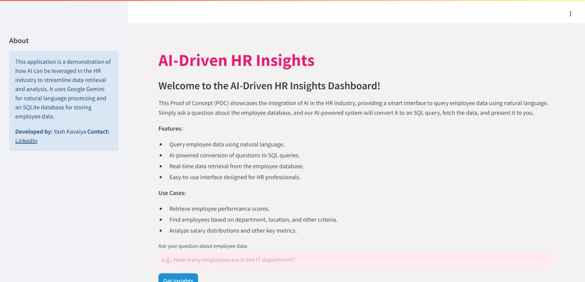
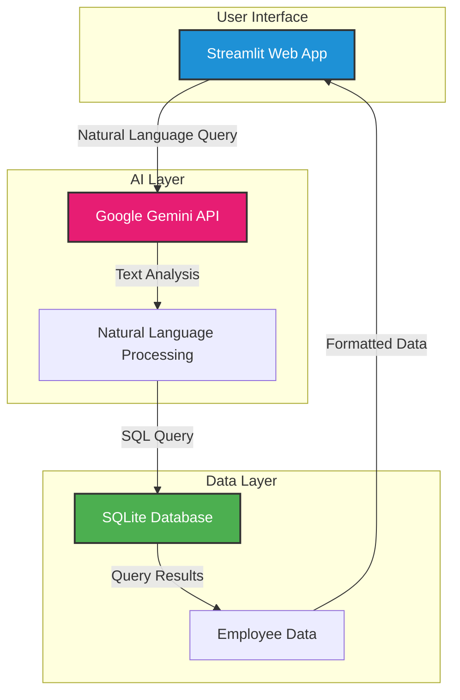
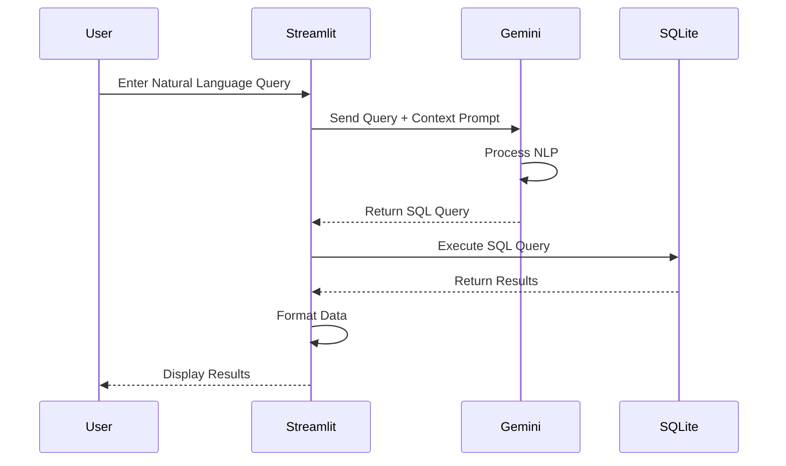
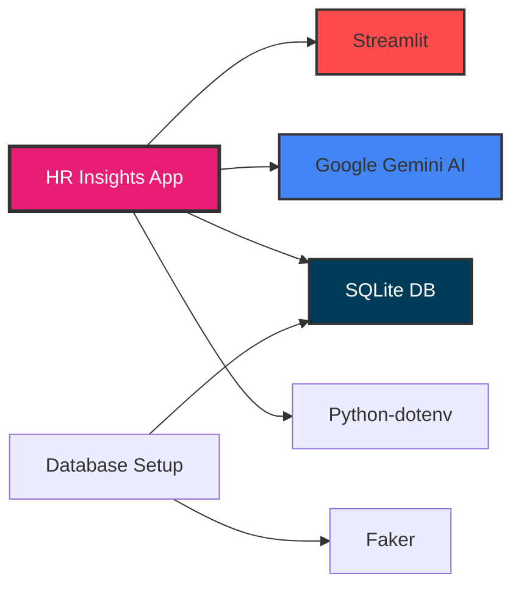
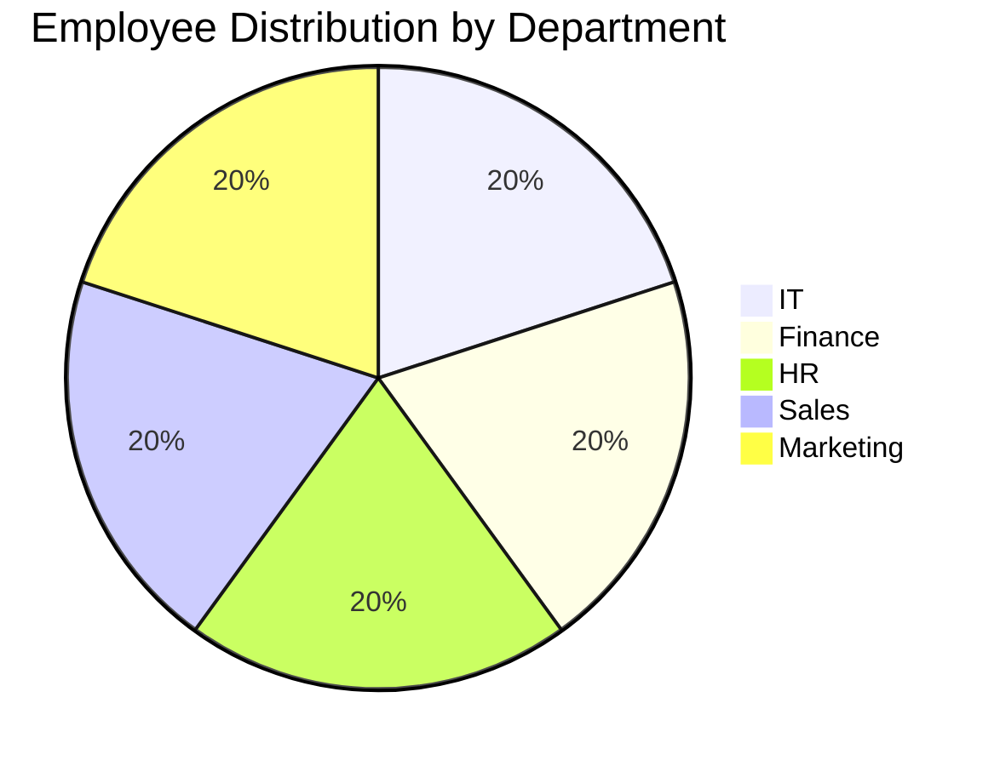
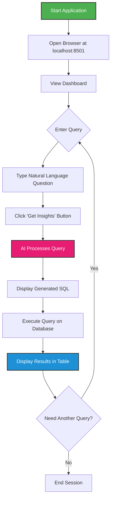
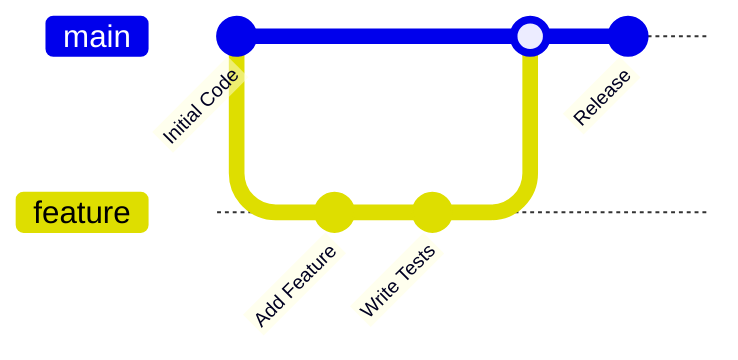

# 🚀 𝗧𝗿𝗮𝗻𝘀𝗳𝗼𝗿𝗺𝗶𝗻𝗴 𝗛𝗥 𝗤𝘂𝗲𝗿𝘆 𝗠𝗮𝗻𝗮𝗴𝗲𝗺𝗲𝗻𝘁 𝘄𝗶𝘁𝗵 𝗔𝗜

[](https://www.python.org/)
[](https://streamlit.io/)
[](https://opensource.org/licenses/MIT)
[](https://huggingface.co/spaces/yashkavaiya/HR-Insights)

This project is a **Proof of Concept (POC)** that demonstrates the integration of AI in the HR industry. The application provides a smart interface to query employee data using natural language. By leveraging Google Gemini for natural language processing and an SQLite database for data storage, this app showcases how AI can streamline data retrieval and analysis for HR professionals.



## 🔗 Quick Links

| Resource | Link |
|----------|------|
| 🎥 **Video Demo** | [Watch on YouTube](https://youtu.be/GN_zE5FG-oo?si=LkEOYVyotTVBV6zn) |
| 🚀 **Live Demo** | [Try on HuggingFace](https://huggingface.co/spaces/yashkavaiya/HR-Insights) |
| 📚 **Documentation** | [Deployment Guide](https://medium.com/@yash.kavaiya3/streamlining-your-streamlit-app-deployment-with-docker-0f6aff7bce48) |

## 📋 Table of Contents

- [System Architecture](#️-system-architecture)
- [Data Flow](#-data-flow)
- [Features](#-features)
- [Use Cases](#-use-cases)
- [Tech Stack](#️-tech-stack)
- [Database Schema](#-database-schema)
- [Installation](#-installation)
- [Usage](#-usage)
- [Sample Queries](#-sample-queries)
- [Contributing](#-contributing)
- [License](#-license)
- [Contact & Support](#-contact--support)

## 🏗️ System Architecture



## 🔄 Data Flow



## ✨ Features

| Feature | Description |
|---------|-------------|
| 🗣️ **Natural Language Query** | Query employee data using plain English |
| 🤖 **AI-Powered Conversion** | Automatic conversion of questions to SQL queries |
| ⚡ **Real-time Data Retrieval** | Instant data retrieval from the employee database |
| 🎨 **User-Friendly Interface** | Easy-to-use interface designed for HR professionals |
| 📊 **Interactive Results** | Results displayed in clean, readable table format |
| 🔒 **Secure Processing** | Environment-based API key management |

## 💼 Use Cases

| Use Case | Example Query | Benefit |
|----------|---------------|---------|
| 📈 **Performance Analysis** | "Show employees with performance score above 8" | Quick identification of top performers |
| 🏢 **Department Insights** | "How many employees are in IT department?" | Department headcount tracking |
| 💰 **Salary Analytics** | "What is the average salary in Finance?" | Budget planning and analysis |
| 📍 **Location-based Search** | "List employees in Bangalore" | Regional workforce management |
| 🎯 **Experience Tracking** | "Find employees with more than 10 years experience" | Identify senior talent pool |
| 🏆 **Promotion Analysis** | "Show employees promoted in 2022" | Track career progression |

## 🛠️ Tech Stack

| Technology | Version | Purpose | Documentation |
|------------|---------|---------|---------------|
|  | 3.8+ | Core programming language | [Docs](https://docs.python.org/) |
|  | Latest | Web application framework | [Docs](https://docs.streamlit.io/) |
|  | 3.x | Lightweight database | [Docs](https://www.sqlite.org/docs.html) |
|  | API | Natural language processing | [Docs](https://ai.google.dev/) |
|  | Latest | Generate dummy/test data | [Docs](https://faker.readthedocs.io/) |
|  | Latest | Environment variable management | [Docs](https://pypi.org/project/python-dotenv/) |

### Dependencies Overview



## 📊 Database Schema

The application uses a SQLite database with the following schema:

| Column Name | Data Type | Description | Constraints |
|-------------|-----------|-------------|-------------|
| `id` | INTEGER | Unique employee identifier | PRIMARY KEY, AUTOINCREMENT |
| `name` | TEXT | Employee full name | NOT NULL |
| `age` | INTEGER | Employee age | Range: 22-60 |
| `department` | TEXT | Department name | HR, Finance, IT, Sales, Marketing |
| `salary` | REAL | Annual salary in INR | Range: 300,000-1,500,000 |
| `performance_score` | INTEGER | Performance rating | Range: 1-10 |
| `years_of_experience` | INTEGER | Total work experience | Range: 1-35 years |
| `last_promotion_year` | INTEGER | Year of last promotion | Range: 2015-2023 |
| `location` | TEXT | Office location | Mumbai, Delhi, Bangalore, Hyderabad, Chennai |

### Database Statistics



## 🚀 Installation

### Prerequisites

Before you begin, ensure you have the following installed:
- Python 3.8 or higher
- pip (Python package manager)
- Git

### Step-by-Step Installation

#### 1️⃣ Clone the Repository

```bash
git clone https://github.com/Yash-Kavaiya/HR-Insights_ChatwithDB.git
cd HR-Insights_ChatwithDB/HR-Insights_ChatwithDB
```

#### 2️⃣ Create Virtual Environment

**Linux/MacOS:**
```bash
python -m venv venv
source venv/bin/activate
```

**Windows:**
```bash
python -m venv venv
venv\Scripts\activate
```

#### 3️⃣ Install Dependencies

```bash
pip install -r requirements.txt
```

#### 4️⃣ Configure Environment Variables

Create a `.env` file in the `HR-Insights_ChatwithDB` directory:

```env
GOOGLE_API_KEY=your_google_api_key_here
```

> 💡 **Get Your API Key:** Visit [Google AI Studio](https://makersuite.google.com/app/apikey) to obtain your Gemini API key

#### 5️⃣ Set Up Database

Generate sample employee data:

```bash
python Create_db.py
```

This will create:
- `employee_kpi.db` - SQLite database with 5000 employee records
- `employee_kpi.csv` - CSV export of the data

#### 6️⃣ Launch Application

```bash
streamlit run main.py
```

The application will open in your default browser at `http://localhost:8501`

### 🐳 Docker Installation (Alternative)

```bash
docker build -t hr-insights .
docker run -p 8501:8501 -e GOOGLE_API_KEY=your_key_here hr-insights
```

For detailed Docker deployment guide, check [this article](https://medium.com/@yash.kavaiya3/streamlining-your-streamlit-app-deployment-with-docker-0f6aff7bce48).

## 📖 Usage

### Application Workflow



### Quick Start Guide

1. **Launch the Application**
   ```bash
   streamlit run main.py
   ```

2. **Access the Interface**
   - Open browser at `http://localhost:8501`
   - You'll see the AI-Driven HR Insights Dashboard

3. **Ask Questions**
   - Type your question in natural language
   - Example: "How many employees are in the IT department?"

4. **View Results**
   - Generated SQL query appears first
   - Results displayed in an interactive table
   - Sidebar provides additional information

## 🔍 Sample Queries

Here are example queries you can try:

| Category | Natural Language Query | Generated SQL (Expected) |
|----------|----------------------|--------------------------|
| **Count** | "How many employees are there?" | `SELECT COUNT(*) FROM EMPLOYEE;` |
| **Filter** | "Show all employees in IT department" | `SELECT * FROM EMPLOYEE WHERE DEPARTMENT='IT';` |
| **Average** | "What is the average salary in Finance?" | `SELECT AVG(SALARY) FROM EMPLOYEE WHERE DEPARTMENT='Finance';` |
| **Top N** | "List top 5 highest paid employees" | `SELECT * FROM EMPLOYEE ORDER BY SALARY DESC LIMIT 5;` |
| **Range** | "Show employees aged between 30 and 40" | `SELECT * FROM EMPLOYEE WHERE AGE BETWEEN 30 AND 40;` |
| **Complex** | "Find employees in HR department located in Mumbai" | `SELECT * FROM EMPLOYEE WHERE DEPARTMENT='HR' AND LOCATION='Mumbai';` |
| **Aggregation** | "Total salary expenditure for Sales department" | `SELECT SUM(SALARY) FROM EMPLOYEE WHERE DEPARTMENT='Sales';` |
| **Performance** | "List employees with performance score of 10" | `SELECT * FROM EMPLOYEE WHERE PERFORMANCE_SCORE=10;` |

### Query Tips

- ✅ Use clear, specific questions
- ✅ Mention department, location, or other criteria explicitly
- ✅ Use comparative terms like "more than", "less than", "between"
- ✅ Specify if you want counts, averages, or lists
- ❌ Avoid ambiguous questions
- ❌ Don't use terms not in the database schema

## 🤝 Contributing

We welcome contributions! Here's how you can help:

### Contribution Process



### Steps to Contribute

1. **Fork the Repository**
2. **Create a Feature Branch**
   ```bash
   git checkout -b feature/AmazingFeature
   ```
3. **Commit Your Changes**
   ```bash
   git commit -m 'Add some AmazingFeature'
   ```
4. **Push to the Branch**
   ```bash
   git push origin feature/AmazingFeature
   ```
5. **Open a Pull Request**

### Contribution Guidelines

| Type | Description |
|------|-------------|
| 🐛 **Bug Reports** | Report bugs via GitHub Issues |
| 💡 **Feature Requests** | Suggest new features via Issues |
| 📝 **Documentation** | Improve documentation |
| 🧪 **Tests** | Add or improve test coverage |
| 🔧 **Code** | Fix bugs or implement features |

## 📚 Additional Resources

| Resource | Description | Link |
|----------|-------------|------|
| 📖 **Deployment Guide** | Docker deployment tutorial | [Medium Article](https://medium.com/@yash.kavaiya3/streamlining-your-streamlit-app-deployment-with-docker-0f6aff7bce48) |
| 🎥 **Video Tutorial** | Complete walkthrough | [YouTube](https://youtu.be/GN_zE5FG-oo?si=LkEOYVyotTVBV6zn) |
| 🚀 **Live Demo** | Try the application | [HuggingFace Space](https://huggingface.co/spaces/yashkavaiya/HR-Insights) |
| 📋 **Test Cases** | Comprehensive test scenarios | [Testcase.md](./Testcase.md) |

## 🔒 Security & Privacy

> ⚠️ **Important Notice**: This is a POC (Proof of Concept) application and not intended for production use with real employee data.

### Security Considerations

| Aspect | Recommendation |
|--------|----------------|
| 🔐 **API Keys** | Store in `.env` file, never commit to Git |
| 📊 **Data Privacy** | Use dummy data only; comply with GDPR/data regulations |
| 🛡️ **Authentication** | Add authentication before production deployment |
| 🔒 **Database Security** | Implement proper access controls for production |
| 📝 **Audit Logs** | Log all queries for compliance tracking |

## 📄 License

This project is licensed under the **MIT License** - see the [LICENSE](LICENSE) file for details.

```
MIT License - Copyright (c) 2024 Yash Kavaiya
```

## 👨‍💻 Contact & Support

<div align="center">

### Connect with the Developer

| Platform | Link |
|----------|------|
| 👤 **Developer** | Yash Kavaiya |
| 💼 **LinkedIn** | [Connect on LinkedIn](https://www.linkedin.com/in/yashkavaiya/) |
| 📧 **Email** | [yash.kavaiya3@gmail.com](mailto:yash.kavaiya3@gmail.com) |
| 🐙 **GitHub** | [@Yash-Kavaiya](https://github.com/Yash-Kavaiya) |
| 🤗 **HuggingFace** | [yashkavaiya](https://huggingface.co/yashkavaiya) |

</div>

## 🌟 Project Stats


---

<div align="center">

**Made with ❤️ by [Yash Kavaiya](https://github.com/Yash-Kavaiya)**

*If you find this project helpful, please consider giving it a ⭐!*

</div>
